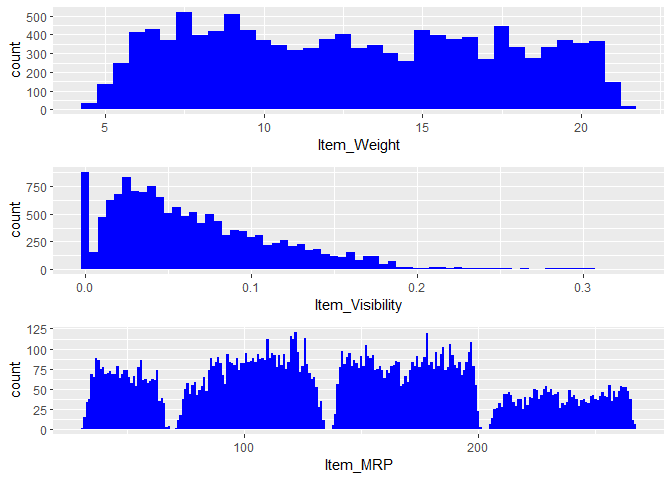

Sales_Analysis
================
Devansh
28/10/2021

# Importing Necessary Libraries

``` r
library(data.table)
library(dplyr)
```

    ## 
    ## Attaching package: 'dplyr'

    ## The following objects are masked from 'package:data.table':
    ## 
    ##     between, first, last

    ## The following objects are masked from 'package:stats':
    ## 
    ##     filter, lag

    ## The following objects are masked from 'package:base':
    ## 
    ##     intersect, setdiff, setequal, union

``` r
library(ggplot2)
library(corrplot)
```


``` r
library(xgboost)
```

``` r
library(cowplot)
library(knitr)
library(caret)
```

``` r
library(moments)
```

# Reading Datasets

``` r
train_dataset <- fread("train_dataset.csv")
test_dataset <- fread("test_dataset.csv")
```

# Basic Details about Training Dataset

## Dimension of Training Dataset

``` r
dim(train_dataset)
```

    ## [1] 8523   12

## Column Names of Training Dataset

``` r
names(train_dataset)
```

    ##  [1] "Item_Identifier"           "Item_Weight"              
    ##  [3] "Item_Fat_Content"          "Item_Visibility"          
    ##  [5] "Item_Type"                 "Item_MRP"                 
    ##  [7] "Outlet_Identifier"         "Outlet_Establishment_Year"
    ##  [9] "Outlet_Size"               "Outlet_Location_Type"     
    ## [11] "Outlet_Type"               "Item_Outlet_Sales"

## Structure of Training Dataset

``` r
str(train_dataset)
```

    ## Classes 'data.table' and 'data.frame':   8523 obs. of  12 variables:
    ##  $ Item_Identifier          : chr  "FDA15" "DRC01" "FDN15" "FDX07" ...
    ##  $ Item_Weight              : num  9.3 5.92 17.5 19.2 8.93 ...
    ##  $ Item_Fat_Content         : chr  "Low Fat" "Regular" "Low Fat" "Regular" ...
    ##  $ Item_Visibility          : num  0.016 0.0193 0.0168 0 0 ...
    ##  $ Item_Type                : chr  "Dairy" "Soft Drinks" "Meat" "Fruits and Vegetables" ...
    ##  $ Item_MRP                 : num  249.8 48.3 141.6 182.1 53.9 ...
    ##  $ Outlet_Identifier        : chr  "OUT049" "OUT018" "OUT049" "OUT010" ...
    ##  $ Outlet_Establishment_Year: int  1999 2009 1999 1998 1987 2009 1987 1985 2002 2007 ...
    ##  $ Outlet_Size              : chr  "Medium" "Medium" "Medium" "" ...
    ##  $ Outlet_Location_Type     : chr  "Tier 1" "Tier 3" "Tier 1" "Tier 3" ...
    ##  $ Outlet_Type              : chr  "Supermarket Type1" "Supermarket Type2" "Supermarket Type1" "Grocery Store" ...
    ##  $ Item_Outlet_Sales        : num  3735 443 2097 732 995 ...
    ##  - attr(*, ".internal.selfref")=<externalptr>

Item_Identifier Item_Weight Item_Fat_Content Item_Visibility 1: FDA15
9.300 Low Fat 0.01604730 2: DRC01 5.920 Regular 0.01927822 3: FDN15
17.500 Low Fat 0.01676007 4: FDX07 19.200 Regular 0.00000000 5: NCD19
8.930 Low Fat 0.00000000 6: FDP36 10.395 Regular 0.00000000 Item_Type
Item_MRP Outlet_Identifier Outlet_Establishment_Year 1: Dairy 249.8092
OUT049 1999 2: Soft Drinks 48.2692 OUT018 2009 3: Meat 141.6180 OUT049
1999 4: Fruits and Vegetables 182.0950 OUT010 1998 5: Household 53.8614
OUT013 1987 6: Baking Goods 51.4008 OUT018 2009 Outlet_Size
Outlet_Location_Type Outlet_Type Item_Outlet_Sales 1: Medium Tier 1
Supermarket Type1 3735.1380 2: Medium Tier 3 Supermarket Type2 443.4228
3: Medium Tier 1 Supermarket Type1 2097.2700 4: Tier 3 Grocery Store
732.3800 5: High Tier 3 Supermarket Type1 994.7052 6: Medium Tier 3
Supermarket Type2 556.6088

# Basic Details about Testing Dataset

## Dimension of Testing Dataset

``` r
dim(test_dataset)
```

    ## [1] 5681   11

## Column Names of Testing Dataset

``` r
names(test_dataset)
```

    ##  [1] "Item_Identifier"           "Item_Weight"              
    ##  [3] "Item_Fat_Content"          "Item_Visibility"          
    ##  [5] "Item_Type"                 "Item_MRP"                 
    ##  [7] "Outlet_Identifier"         "Outlet_Establishment_Year"
    ##  [9] "Outlet_Size"               "Outlet_Location_Type"     
    ## [11] "Outlet_Type"

## Structure of Testing Dataset

``` r
str(test_dataset)
```

    ## Classes 'data.table' and 'data.frame':   5681 obs. of  11 variables:
    ##  $ Item_Identifier          : chr  "FDW58" "FDW14" "NCN55" "FDQ58" ...
    ##  $ Item_Weight              : num  20.75 8.3 14.6 7.32 NA ...
    ##  $ Item_Fat_Content         : chr  "Low Fat" "reg" "Low Fat" "Low Fat" ...
    ##  $ Item_Visibility          : num  0.00756 0.03843 0.09957 0.01539 0.1186 ...
    ##  $ Item_Type                : chr  "Snack Foods" "Dairy" "Others" "Snack Foods" ...
    ##  $ Item_MRP                 : num  107.9 87.3 241.8 155 234.2 ...
    ##  $ Outlet_Identifier        : chr  "OUT049" "OUT017" "OUT010" "OUT017" ...
    ##  $ Outlet_Establishment_Year: int  1999 2007 1998 2007 1985 1997 2009 1985 2002 2007 ...
    ##  $ Outlet_Size              : chr  "Medium" "" "" "" ...
    ##  $ Outlet_Location_Type     : chr  "Tier 1" "Tier 2" "Tier 3" "Tier 2" ...
    ##  $ Outlet_Type              : chr  "Supermarket Type1" "Supermarket Type1" "Grocery Store" "Supermarket Type1" ...
    ##  - attr(*, ".internal.selfref")=<externalptr>

``` r
head(test_dataset)
```

    ##    Item_Identifier Item_Weight Item_Fat_Content Item_Visibility
    ## 1:           FDW58      20.750          Low Fat     0.007564836
    ## 2:           FDW14       8.300              reg     0.038427677
    ## 3:           NCN55      14.600          Low Fat     0.099574908
    ## 4:           FDQ58       7.315          Low Fat     0.015388393
    ## 5:           FDY38          NA          Regular     0.118599314
    ## 6:           FDH56       9.800          Regular     0.063817206
    ##                Item_Type Item_MRP Outlet_Identifier Outlet_Establishment_Year
    ## 1:           Snack Foods 107.8622            OUT049                      1999
    ## 2:                 Dairy  87.3198            OUT017                      2007
    ## 3:                Others 241.7538            OUT010                      1998
    ## 4:           Snack Foods 155.0340            OUT017                      2007
    ## 5:                 Dairy 234.2300            OUT027                      1985
    ## 6: Fruits and Vegetables 117.1492            OUT046                      1997
    ##    Outlet_Size Outlet_Location_Type       Outlet_Type
    ## 1:      Medium               Tier 1 Supermarket Type1
    ## 2:                           Tier 2 Supermarket Type1
    ## 3:                           Tier 3     Grocery Store
    ## 4:                           Tier 2 Supermarket Type1
    ## 5:      Medium               Tier 3 Supermarket Type3
    ## 6:       Small               Tier 1 Supermarket Type1

``` r
test_dataset[,Item_Outlet_Sales := NA] 
merged = rbind(train_dataset, test_dataset) 
dim(merged)
```

    ## [1] 14204    12

<hr style="border:2px solid gray">
</hr>

# Univarite Analysis

# Continuous Data

## Item_Outlet_Sales is Dependent Variable

``` r
ggplot(train_dataset) + geom_histogram(aes(train_dataset$Item_Outlet_Sales), binwidth = 100, fill = "darkgreen") +
  xlab("Item_Outlet_Sales")
```

<!-- --> **Insight -
Data here is Right Skewed**

## Item_Weight, Item_Visibility, Item_MRP are Independent Variables

``` r
p1 = ggplot(merged) + geom_histogram(aes(Item_Weight), binwidth = 0.5, fill = "blue")
p2 = ggplot(merged) + geom_histogram(aes(Item_Visibility), binwidth = 0.005, fill = "blue")
p3 = ggplot(merged) + geom_histogram(aes(Item_MRP), binwidth = 1, fill = "blue")
plot_grid(p1, p2, p3, ncol = 1) # plot_grid() from cowplot package
```

    ## Warning: Removed 2439 rows containing non-finite values (stat_bin).

<!-- -->

**Insights -** + No Pattern in Item_Weight + Item_Visibility is Right
Skewed + Item_MRP has 4 sections

# Categorical Data

``` r
ggplot(merged %>% group_by(Item_Fat_Content) %>% summarise(Count = n())) + 
  geom_bar(aes(Item_Fat_Content, Count), stat = "identity", fill = "#9075D8")
```

<!-- --> **Here LF, low
fat, Low Fat refers to single Entity only, so they should be renamed to
Low Fat to remove redundancy and same goes for reg and Regular**

``` r
merged$Item_Fat_Content[merged$Item_Fat_Content == "low fat"] <- "Low Fat"
merged$Item_Fat_Content[merged$Item_Fat_Content == "LF"] <- "Low Fat"
merged$Item_Fat_Content[merged$Item_Fat_Content == "reg"] <- "Regular"
```

**Updated Graph**

``` r
ggplot(merged %>% group_by(Item_Fat_Content) %>% summarise(Count = n())) + 
  geom_bar(aes(Item_Fat_Content, Count), stat = "identity", fill = "#9075D8")
```

<!-- --> **Insight -
Low Fat has more counts than Regular**

``` r
ggplot(merged %>% group_by(Item_Type) %>% summarise(Count = n())) + 
  geom_bar(aes(Item_Type, Count), stat = "identity", fill = "coral1") +
  xlab("") +
  geom_label(aes(Item_Type, Count, label = Count), vjust = 0.5) +
  theme(axis.text.x = element_text(angle = 45, hjust = 1))+
  ggtitle("Item_Type")
```

<!-- --> **Insight -
Fruits and Vegetables are biggest sellers while Seafood is the least**

``` r
ggplot(merged %>% group_by(Outlet_Identifier) %>% summarise(Count = n())) + 
  geom_bar(aes(Outlet_Identifier, Count), stat = "identity", fill = "coral1") +
  geom_label(aes(Outlet_Identifier, Count, label = Count), vjust = 0.5) +
  theme(axis.text.x = element_text(angle = 45, hjust = 1))
```

<!-- -->

``` r
ggplot(merged %>% group_by(Outlet_Size) %>% summarise(Count = n())) + 
  geom_bar(aes(Outlet_Size, Count), stat = "identity", fill = "coral1") +
  geom_label(aes(Outlet_Size, Count, label = Count), vjust = 0.5) +
  theme(axis.text.x = element_text(angle = 45, hjust = 1))
```

<!-- --> **Insight -
4016 outlets don’t have a outlet size**

``` r
ggplot(merged %>% group_by(Outlet_Establishment_Year) %>% summarise(Count = n())) + 
  geom_bar(aes(factor(Outlet_Establishment_Year), Count), stat = "identity", fill = "coral1") +
  geom_label(aes(factor(Outlet_Establishment_Year), Count, label = Count), vjust = 0.5) +
  xlab("Outlet_Establishment_Year") +
  theme(axis.text.x = element_text(size = 8.5))
```

<!-- -->

``` r
ggplot(merged %>% group_by(Outlet_Type) %>% summarise(Count = n())) + 
  geom_bar(aes(Outlet_Type, Count), stat = "identity", fill = "coral1") +
  geom_label(aes(factor(Outlet_Type), Count, label = Count), vjust = 0.5) +
  theme(axis.text.x = element_text(size = 8.5))
```

<!-- --> **Insight -
Type 1 Supermarket is has the popular Outlet Type**

<hr style="border:2px solid gray">
</hr>

# Bivarite Analysis

Updating the Training Dataset

``` r
train_dataset = merged[1:nrow(train_dataset)]
```

## Continuous Variables

``` r
ggplot(train_dataset) + geom_point(aes(Item_Weight, Item_Outlet_Sales), colour = "violet", alpha = 0.3) +
     theme(axis.title = element_text(size = 8.5))
```

    ## Warning: Removed 1463 rows containing missing values (geom_point).

<!-- --> **Insight -
Item_Outlet_Sales is spread well across the entire range of the
Item_Weight without any obvious pattern.**

``` r
ggplot(train_dataset) + geom_point(aes(Item_Visibility, Item_Outlet_Sales), colour = "violet", alpha = 0.3) +
     theme(axis.title = element_text(size = 8.5))
```

<!-- --> **Insight - In
the Item_Visibility vs Item_Outlet_Sales, there is a string of points at
Item_Visibility = 0.0 which seems strange as item visibility cannot be
completely zero. We will take note of this issue and deal with it in the
later stages.**

``` r
ggplot(train_dataset) + geom_point(aes(Item_MRP, Item_Outlet_Sales), colour = "violet", alpha = 0.3) +
     theme(axis.title = element_text(size = 8.5))
```

<!-- --> **Insight - In
Item_MRP vs Item_Outlet_Sales, we can clearly see 4 segments of prices
that can be used in feature engineering to create a new variable.**

<hr style="border:2px solid gray">
</hr>

## Categorical Variables

``` r
ggplot(train_dataset) + geom_violin(aes(Item_Type, Item_Outlet_Sales), fill = "magenta") +
  theme(axis.text.x = element_text(angle = 45, hjust = 1),
        axis.text = element_text(size = 6),
        axis.title = element_text(size = 8.5))
```

<!-- -->

``` r
ggplot(train_dataset) + geom_violin(aes(Item_Fat_Content, Item_Outlet_Sales), fill = "magenta") +
  theme(axis.text.x = element_text(angle = 45, hjust = 1),
        axis.text = element_text(size = 8),
        axis.title = element_text(size = 8.5))
```

<!-- --> **Insight -
Distribution of Item_Outlet_Sales across the categories of Item_Type is
not very distinct and same is the case with Item_Fat_Content.**

``` r
ggplot(train_dataset) + geom_violin(aes(Outlet_Identifier, Item_Outlet_Sales), fill = "magenta") +
  theme(axis.text.x = element_text(angle = 45, hjust = 1),
        axis.text = element_text(size = 8),
        axis.title = element_text(size = 8.5))
```

<!-- -->

**Insight - The distribution for OUT010 and OUT019 categories of
Outlet_Identifier are quite similar and very much different from the
rest of the categories of Outlet_Identifier.**

``` r
ggplot(train_dataset) + geom_violin(aes(Outlet_Size, Item_Outlet_Sales), fill = "magenta")
```

<!-- -->

``` r
ggplot(train_dataset) + geom_violin(aes(Outlet_Location_Type, Item_Outlet_Sales), fill = "magenta")
```

<!-- -->

``` r
ggplot(train_dataset) + geom_violin(aes(Outlet_Type, Item_Outlet_Sales), fill = "magenta")
```

<!-- -->

<hr style="border:2px solid gray">
</hr>

# Missing Value Treatment

``` r
colSums(is.na(merged))
```

    ##           Item_Identifier               Item_Weight          Item_Fat_Content 
    ##                         0                      2439                         0 
    ##           Item_Visibility                 Item_Type                  Item_MRP 
    ##                         0                         0                         0 
    ##         Outlet_Identifier Outlet_Establishment_Year               Outlet_Size 
    ##                         0                         0                         0 
    ##      Outlet_Location_Type               Outlet_Type         Item_Outlet_Sales 
    ##                         0                         0                      5681

#### Replacing Null values with mean value in Item_Weight

``` r
missing_index = which(is.na(merged$Item_Weight))
for(i in missing_index){
  
  item = merged$Item_Identifier[i]
  merged$Item_Weight[i] = mean(merged$Item_Weight[merged$Item_Identifier == item], na.rm = T)
  
}
```

#### Replacing 0’s in Item_Visibility variable

``` r
zero_index = which(merged$Item_Visibility == 0)
for(i in zero_index){
  
  item = merged$Item_Identifier[i]
  merged$Item_Visibility[i] = mean(merged$Item_Visibility[merged$Item_Identifier == item], na.rm = T)
  
}
```

``` r
ggplot(merged) + geom_histogram(aes(Item_Visibility), bins=100)
```

<!-- -->

``` r
table(train_dataset$Outlet_Size)
```

    ## 
    ##          High Medium  Small 
    ##   2410    932   2793   2388

**Since Medium value is has the most frequency so replacing blank
strings with medium**

``` r
train_dataset$Outlet_Size[train_dataset$Outlet_Size==""]<-"Medium"
```

``` r
ggplot(train_dataset) + geom_violin(aes(Outlet_Size, Item_Outlet_Sales), fill = "magenta")
```

<!-- -->

<hr style="border:2px solid gray">
</hr>

# Feature Engineering

-   Item_Type_new: Broader categories for the variable Item_Type.
-   Item_category: Categorical variable derived from Item_Identifier.
-   Outlet_Years: Years of operation for outlets.
-   price_per_unit_wt: Item_MRP/Item_Weight
-   Item_MRP_clusters: Binned feature for Item_MRP.

``` r
table(merged$Item_Type)
```

    ## 
    ##          Baking Goods                Breads             Breakfast 
    ##                  1086                   416                   186 
    ##                Canned                 Dairy          Frozen Foods 
    ##                  1084                  1136                  1426 
    ## Fruits and Vegetables           Hard Drinks    Health and Hygiene 
    ##                  2013                   362                   858 
    ##             Household                  Meat                Others 
    ##                  1548                   736                   280 
    ##               Seafood           Snack Foods           Soft Drinks 
    ##                    89                  1989                   726 
    ##         Starchy Foods 
    ##                   269

``` r
perishable = c("Breads", "Breakfast", "Dairy", "Fruits and Vegetables", "Meat", "Seafood")
non_perishable = c("Baking Goods", "Canned", "Frozen Foods", "Hard Drinks", "Health and Hygiene",
                   "Household", "Soft Drinks")
merged[,Item_Type_new := ifelse(Item_Type %in% perishable, "perishable",
                               ifelse(Item_Type %in% non_perishable, "non_perishable", "not_sure"))]
```

``` r
merged[,Item_category := substr(merged$Item_Identifier, 1, 2)]
merged$Item_Fat_Content[merged$Item_category == "NC"] = "Non-Edible"
```

``` r
merged[,Outlet_Years := 2013 - Outlet_Establishment_Year]
merged$Outlet_Establishment_Year = as.factor(merged$Outlet_Establishment_Year)
```

``` r
# Price per unit weight
merged[,price_per_unit_wt := Item_MRP/Item_Weight]
```

Earlier in the Item_MRP vs Item_Outlet_Sales plot, we saw Item_MRP was
spread across in 4 chunks. We can use k Means clustering to create 4
groups using Item_MRP variable.

``` r
ggplot(train_dataset) + geom_point(aes(Item_MRP, Item_Outlet_Sales), colour = "violet", alpha = 0.3) +
     theme(axis.title = element_text(size = 8.5))
```

<!-- -->

``` r
Item_MRP_clusters = kmeans(merged$Item_MRP, centers = 4)
table(Item_MRP_clusters$cluster)
```

    ## 
    ##    1    2    3    4 
    ## 4317 2556 4931 2400

``` r
merged$Item_MRP_clusters = as.factor(Item_MRP_clusters$cluster)
```

<hr style="border:2px solid gray">
</hr>

# Encoding Categorical Variables

In this stage, we will convert our categorical variables into numerical
ones. We will use 2 techniques — Label Encoding and One Hot Encoding.

-   **Label encoding** simply means converting each category in a
    variable to a number. It is more suitable for ordinal variables —
    categorical variables with some order.

-   In **One hot encoding**, each category of a categorical variable is
    converted into a new bunary column (1/0).

### Label encoding for the categorical variables

We will label encode Outlet_Size and Outlet_Location_Type as these are
ordinal variables.

``` r
merged[,Outlet_Size_num := ifelse(Outlet_Size == "Small", 0,
                                 ifelse(Outlet_Size == "Medium", 1, 2))]
merged[,Outlet_Location_Type_num := ifelse(Outlet_Location_Type == "Tier 3", 0,
                                          ifelse(Outlet_Location_Type == "Tier 2", 1, 2))]
# removing categorical variables after label encoding
merged[, c("Outlet_Size", "Outlet_Location_Type") := NULL]
```

``` r
ohe = dummyVars("~.", data = merged[,-c("Item_Identifier", "Outlet_Establishment_Year", "Item_Type")], fullRank = T)
ohe_df = data.table(predict(ohe, merged[,-c("Item_Identifier", "Outlet_Establishment_Year", "Item_Type")]))
merged = cbind(merged[,"Item_Identifier"], ohe_df)
```

<hr style="border:2px solid gray">
</hr>

# Pre Processing Data

### Checking Skewness

Skewness in variables is undesirable for predictive modeling. Some
machine learning methods assume normally distributed data and a skewed
variable can be transformed by taking its log, square root, or cube root
so as to make the distribution of the skewed variable as close to normal
distribution as possible.

``` r
skewness(merged$Item_Visibility) 
```

    ## [1] 1.254178

``` r
skewness(merged$price_per_unit_wt)
```

    ## [1] 1.304689

``` r
merged[,Item_Visibility := log(Item_Visibility + 1)] # log + 1 to avoid division by zero
merged[,price_per_unit_wt := log(price_per_unit_wt + 1)]
```

``` r
num_vars = which(sapply(merged, is.numeric)) # index of numeric features
num_vars_names = names(num_vars)
combi_numeric = merged[,setdiff(num_vars_names, "Item_Outlet_Sales"), with = F]
prep_num = preProcess(combi_numeric, method=c("center", "scale"))
combi_numeric_norm = predict(prep_num, combi_numeric)
```

``` r
merged[,setdiff(num_vars_names, "Item_Outlet_Sales") := NULL] # removing numeric independent variables
merged = cbind(merged, combi_numeric_norm)
```

``` r
train_dataset = merged[1:nrow(train_dataset)]
test_dataset = merged[(nrow(train_dataset) + 1):nrow(merged)]
test_dataset[,Item_Outlet_Sales := NULL] # removing Item_Outlet_Sales as it contains only NA
```

# Correlated Variables

-   negative correlation: \< 0 and >= -1
-   positive correlation: > 0 and \<= 1
-   no correlation: 0 It is not desirable to have correlated features if
    we are using linear regressions.

``` r
cor_train = cor(train_dataset[,-c("Item_Identifier")])
corrplot(cor_train, method = "pie", type = "lower", tl.cex = 0.5, number.cex=0.75)
```

<!-- -->

# Modeling

## Linear Regression

``` r
linear_reg_mod = lm(Item_Outlet_Sales ~ ., data = train_dataset[,-c("Item_Identifier")])
```

``` r
set.seed(1234)
my_control = trainControl(method="cv", number=5)
linear_reg_mod = train(x = train_dataset[,-c("Item_Identifier", "Item_Outlet_Sales")], y = train_dataset$Item_Outlet_Sales,
                       method='glmnet', trControl= my_control)
```

``` r
print(round(linear_reg_mod$resample$RMSE, 2))
```

    ## [1] 1128.00 1119.71 1148.81 1122.21 1132.37

## Lasso Regression

``` r
set.seed(1235)
my_control = trainControl(method="cv", number=5)
Grid = expand.grid(alpha = 1, lambda = seq(0.001,0.1,by = 0.0002))

lasso_linear_reg_mod = train(x = train_dataset[, -c("Item_Identifier", "Item_Outlet_Sales")], y = train_dataset$Item_Outlet_Sales,
                       method='glmnet', trControl= my_control, tuneGrid = Grid)
```

``` r
print(round(lasso_linear_reg_mod$resample$RMSE, 2))
```

    ## [1] 1115.45 1117.71 1170.93 1117.42 1126.37

## Ridge Regression

``` r
set.seed(1236)
my_control = trainControl(method="cv", number=5)
Grid = expand.grid(alpha = 0, lambda = seq(0.001,0.1,by = 0.0002))

ridge_linear_reg_mod = train(x = train_dataset[, -c("Item_Identifier", "Item_Outlet_Sales")], y = train_dataset$Item_Outlet_Sales,
                       method='glmnet', trControl= my_control, tuneGrid = Grid)
```

``` r
print(round(ridge_linear_reg_mod$resample$RMSE, 2))
```

    ## [1] 1127.10 1136.83 1112.18 1151.65 1147.28

## Random Forest

``` r
set.seed(1237)
my_control = trainControl(method="cv", number=5)

tgrid = expand.grid(
  .mtry = c(3:10),
  .splitrule = "variance",
  .min.node.size = c(10,15,20)
)

rf_mod = train(x = train_dataset[, -c("Item_Identifier", "Item_Outlet_Sales")], 
               y = train_dataset$Item_Outlet_Sales,
               method='ranger', 
               trControl= my_control, 
               tuneGrid = tgrid,
               num.trees = 400,
               importance = "permutation")
```

``` r
plot(rf_mod)
```

<!-- -->

## XGBoost

*eta: It is also known as the learning rate or the shrinkage factor. It
actually shrinks the feature weights to make the boosting process more
conservative. The range is 0 to 1. Low eta value means model is more
robust to overfitting. *gamma: The range is 0 to ∞. Larger the gamma
more conservative the algorithm is. *max_depth: We can specify maximum
depth of a tree using this parameter. *subsample: It is the proportion
of rows that the model will randomly select to grow trees.
\*colsample_bytree: It is the ratio of variables randomly chosen for
build each tree in the model.

``` r
param_list = list(
        objective = "reg:linear",
        eta=0.01,
        gamma = 1,
        max_depth=6,
        subsample=0.8,
        colsample_bytree=0.5
        )
```

``` r
dtrain = xgb.DMatrix(data = as.matrix(train_dataset[,-c("Item_Identifier", "Item_Outlet_Sales")]), label= train_dataset$Item_Outlet_Sales)
dtest = xgb.DMatrix(data = as.matrix(test_dataset[,-c("Item_Identifier")]))
```

``` r
set.seed(112)
xgbcv = xgb.cv(params = param_list, 
               data = dtrain, 
               nrounds = 1000, 
               nfold = 5, 
               print_every_n = 10, 
               early_stopping_rounds = 30, 
               maximize = F)
```

    ## [23:49:37] WARNING: amalgamation/../src/objective/regression_obj.cu:171: reg:linear is now deprecated in favor of reg:squarederror.
    ## [23:49:38] WARNING: amalgamation/../src/objective/regression_obj.cu:171: reg:linear is now deprecated in favor of reg:squarederror.
    ## [23:49:38] WARNING: amalgamation/../src/objective/regression_obj.cu:171: reg:linear is now deprecated in favor of reg:squarederror.
    ## [23:49:38] WARNING: amalgamation/../src/objective/regression_obj.cu:171: reg:linear is now deprecated in favor of reg:squarederror.
    ## [23:49:38] WARNING: amalgamation/../src/objective/regression_obj.cu:171: reg:linear is now deprecated in favor of reg:squarederror.
    ## [1]  train-rmse:2746.426563+11.012791    test-rmse:2746.124609+46.485948 
    ## Multiple eval metrics are present. Will use test_rmse for early stopping.
    ## Will train until test_rmse hasn't improved in 30 rounds.
    ## 
    ## [11] train-rmse:2534.915820+12.932503    test-rmse:2535.557959+44.514529 
    ## [21] train-rmse:2346.157471+8.797310 test-rmse:2348.711377+46.953532 
    ## [31] train-rmse:2178.435352+8.555937 test-rmse:2183.243262+45.537466 
    ## [41] train-rmse:2029.716919+9.101704 test-rmse:2036.679224+44.743458 
    ## [51] train-rmse:1895.245068+8.304607 test-rmse:1904.450806+44.368102 
    ## [61] train-rmse:1778.093091+7.450682 test-rmse:1789.413330+43.474933 
    ## [71] train-rmse:1675.044141+8.678941 test-rmse:1689.425244+41.590000 
    ## [81] train-rmse:1584.611499+7.982336 test-rmse:1602.015918+41.185605 
    ## [91] train-rmse:1504.327954+8.253840 test-rmse:1524.824414+40.136791 
    ## [101]    train-rmse:1435.000366+8.975736 test-rmse:1458.640771+39.162169 
    ## [111]    train-rmse:1375.476636+9.144665 test-rmse:1402.516187+38.311832 
    ## [121]    train-rmse:1322.539307+8.776800 test-rmse:1353.235205+37.645687 
    ## [131]    train-rmse:1276.781836+7.660046 test-rmse:1311.027270+37.262348 
    ## [141]    train-rmse:1237.630786+7.777904 test-rmse:1275.737134+36.474950 
    ## [151]    train-rmse:1204.718775+8.253014 test-rmse:1246.407178+35.437350 
    ## [161]    train-rmse:1175.745166+8.651789 test-rmse:1221.151123+34.491445 
    ## [171]    train-rmse:1150.540552+8.527927 test-rmse:1199.311914+33.611187 
    ## [181]    train-rmse:1128.790186+8.507149 test-rmse:1180.714307+32.874591 
    ## [191]    train-rmse:1110.117603+8.480027 test-rmse:1165.421875+32.418683 
    ## [201]    train-rmse:1093.981055+8.520985 test-rmse:1152.708984+31.488380 
    ## [211]    train-rmse:1080.334228+8.627788 test-rmse:1142.032080+30.839125 
    ## [221]    train-rmse:1067.877026+8.526864 test-rmse:1133.006738+30.362900 
    ## [231]    train-rmse:1056.930639+8.481697 test-rmse:1125.186743+29.988489 
    ## [241]    train-rmse:1047.350806+8.136980 test-rmse:1118.837793+29.483709 
    ## [251]    train-rmse:1039.016968+8.046057 test-rmse:1113.513184+29.377324 
    ## [261]    train-rmse:1031.648145+7.842297 test-rmse:1109.446924+29.038420 
    ## [271]    train-rmse:1025.108240+7.972431 test-rmse:1105.853662+28.787111 
    ## [281]    train-rmse:1019.287122+7.955214 test-rmse:1102.729761+28.568983 
    ## [291]    train-rmse:1013.887647+8.140836 test-rmse:1100.133301+28.123670 
    ## [301]    train-rmse:1008.834448+8.107406 test-rmse:1098.268213+27.949988 
    ## [311]    train-rmse:1004.401050+8.187304 test-rmse:1096.631030+27.694182 
    ## [321]    train-rmse:1000.254077+8.058741 test-rmse:1095.335938+27.603206 
    ## [331]    train-rmse:996.168982+7.947834  test-rmse:1094.255688+27.611637 
    ## [341]    train-rmse:992.518445+7.962982  test-rmse:1093.539917+27.419446 
    ## [351]    train-rmse:989.230273+7.844295  test-rmse:1092.851587+27.272178 
    ## [361]    train-rmse:985.809558+7.915672  test-rmse:1092.160376+27.190011 
    ## [371]    train-rmse:982.592932+7.904597  test-rmse:1091.704224+27.054559 
    ## [381]    train-rmse:979.626746+8.125549  test-rmse:1091.416211+27.100782 
    ## [391]    train-rmse:976.541809+7.819250  test-rmse:1091.205396+27.074885 
    ## [401]    train-rmse:973.652698+7.875597  test-rmse:1090.995190+26.884770 
    ## [411]    train-rmse:970.963342+7.750297  test-rmse:1090.834082+26.926708 
    ## [421]    train-rmse:968.413538+7.854292  test-rmse:1090.821094+26.866786 
    ## [431]    train-rmse:965.896228+7.819524  test-rmse:1090.795361+26.839322 
    ## [441]    train-rmse:963.463904+7.747341  test-rmse:1090.759912+26.811081 
    ## [451]    train-rmse:960.920593+7.741991  test-rmse:1090.869263+26.764593 
    ## [461]    train-rmse:958.406042+7.716705  test-rmse:1090.969483+26.760264 
    ## Stopping. Best iteration:
    ## [434]    train-rmse:965.243701+7.732721  test-rmse:1090.729761+26.870842

``` r
xgb_model = xgb.train(data = dtrain, params = param_list, nrounds = 430)
```

    ## [23:50:51] WARNING: amalgamation/../src/objective/regression_obj.cu:171: reg:linear is now deprecated in favor of reg:squarederror.

``` r
var_imp = xgb.importance(feature_names = setdiff(names(train), c("Item_Identifier", "Item_Outlet_Sales")), 
                         model = xgb_model)
xgb.plot.importance(var_imp)
```

<!-- -->

**Item_MRP is the most important variable in predicting the target
variable. New features created by us, like price_per_unit_wt,
Outlet_Years, Item_MRP_Clusters, are also among the top most important
variables.**
